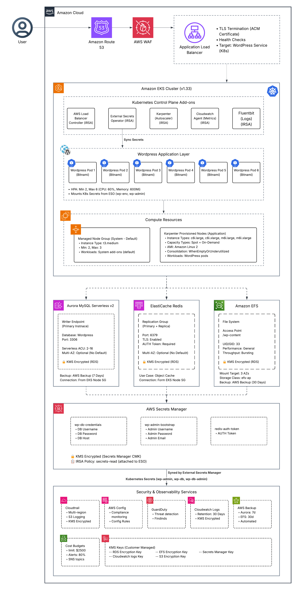
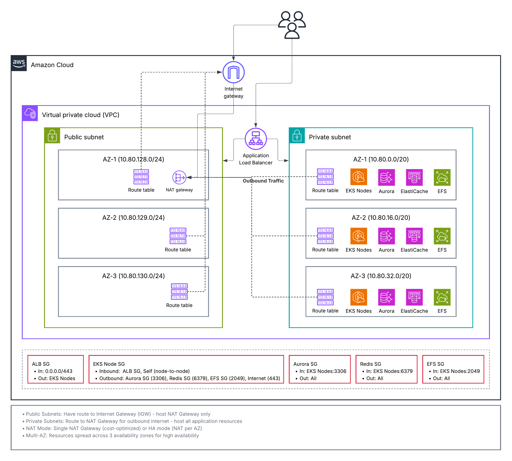

# WordPress on EKS – Project Overview

## High level architecture


## Network architecture


## What This Stack Delivers
- A production-grade AWS foundation (networking, KMS, shared buckets) sized for an EKS-hosted WordPress deployment.
- Managed data services: Aurora MySQL Serverless v2 for the application database, ElastiCache Redis for object caching, and EFS for persistent media.
- An EKS control plane with managed node groups, core add-ons (CNI, CoreDNS, kube-proxy, EFS CSI), and supporting IAM roles.
- A Kubernetes application layer that installs the External Secrets Operator (ESO), AWS Load Balancer Controller, Karpenter, observability agents, and WordPress via Helm.
- Guardrails such as GuardDuty, AWS Config, CloudTrail, and monthly cost budgets.

## Repository Layout
```
stacks/
  infra/     # Terraform root for AWS infrastructure
  app/       # Terraform root for cluster add-ons + WordPress release
modules/     # Reusable building blocks consumed by the stacks
Makefile     # Helper targets for fmt/lint/plan/apply per stack
wordpress-eks.tfvars # Example variable overrides for Terraform runs
```

### Stack Boundaries
| Stack | Key Responsibilities | Terraform Cloud Workspace |
|-------|----------------------|---------------------------|
| `stacks/infra` | Foundation (VPC, NAT, subnets), EKS cluster/IAM, Aurora, EFS, Redis, security baseline, shared secrets | `wp-infra` |
| `stacks/app`   | ESO, AWS Load Balancer Controller, Karpenter, observability add-ons, WordPress Helm release | `wp-app` |

The `stacks/app` configuration consumes outputs published by `stacks/infra` through Terraform Cloud remote state.

## Deployment Flow (High Level)
1. **Terraform Cloud workspaces**: create/run `wp-infra`, then `wp-app`. The app stack refuses to plan until infra has produced required outputs (cluster name, OIDC, secrets policy ARN, etc.).
2. **Infrastructure apply**:
   - Builds networking/KMS, then EKS IAM, then the cluster and node group.
   - Provisions Aurora, EFS (with access point and optional backups), Redis (auth token in Secrets Manager), and security services.
   - Publishes outputs (cluster metadata, secret ARNs, policy ARNs) for downstream stacks.
3. **Application apply**:
   - Installs ESO using the pre-created read policy so it can sync secrets from Secrets Manager.
   - Deploys AWS Load Balancer Controller and issues ACM/WAF resources if enabled.
   - Configures Karpenter for flexible compute, observability agents, and finally installs WordPress via Bitnami Helm chart pointing to Aurora/EFS/Redis.

Refer to `docs/getting-started.md` for the exact Terraform Cloud configuration steps.

## Key AWS/Kubernetes Components
- **Networking**: VPC with three public + three private subnets, NAT gateways (single or per-AZ), internet gateway, and routing tables tagged for Kubernetes discovery.
- **Security & Audit**: Dedicated KMS keys for RDS/EFS/logs/S3, CloudTrail + Config + GuardDuty, cost budget alarms, private secrets in Secrets Manager encrypted by a custom CMK.
- **Data Stores**:
  - Aurora MySQL with Serverless v2 scaling, AWS Backup integration, and secure ingress limited to the EKS node security group.
  - EFS shared filesystem with access point and AWS Backup support for `wp-content`.
  - Redis replication group with TLS/auth, fed from Secrets Manager.
- **EKS Add-ons**: IRSA-enabled AWS controllers (LBC, ESO, CloudWatch Agent, Fluent Bit, EFS CSI), Karpenter node provisioning, namespace-specific service accounts.
- **App Layer**: Bitnami WordPress chart configured for external database, ESO-managed secrets, ALB ingress with optional WAF and ACM certificates, horizontal autoscaling, and EFS-backed storage.

## Tooling & Automation
- **Terraform Cloud** for remote state, execution, and cross-workspace dependencies.
- **Make targets** for local validation (`make fmt`, `make lint`, `make validate-infra`, `make validate-app`) and full plan/apply (`make plan-all`, `make apply-all`).
- **Observability** via CloudWatch Agent and Fluent Bit shipping logs/metrics for both cluster and application workloads.

## Secrets & IAM Relationships
1. `modules/secrets-iam` provisions Secrets Manager entries for WordPress DB credentials, admin bootstrap password, and Redis auth tokens.
2. It also publishes a “secrets-read” IAM policy ARN exposed to the app stack.
3. The app stack feeds that ARN into the ESO module, which creates an IRSA role scoped to the ESO controller service account.
4. ESO fetches secrets from Secrets Manager and materialises Kubernetes secrets consumed by the WordPress Helm release.

## Suggested Reading Order for New Contributors
1. **This document** for context.
2. [`docs/getting-started.md`](./getting-started.md) for workspace setup and deployment steps.
3. [`docs/runbook.md`](./runbook.md) for day-two operations and incident handling.
4. Module-level Terraform files to inspect implementation details as needed.

## Suggested Additional Documentation
- **Architecture Diagram**: A visual (e.g., PlantUML or draw.io) depicting module relationships, network layout, and data flow would help onboarding.
- **Security & Compliance Notes**: Document guardrails, IAM least-privilege assumptions, and patching responsibilities for WordPress.
- **Disaster Recovery Plan**: Formal RTO/RPO targets, backup/restore testing procedures, and cross-region strategy once enabled.
- **CI/CD Integration Guide**: When introducing automated pipelines, capture how plans/applies are triggered and gated.

## Documentation Index
| Topic | Location | Notes |
|-------|----------|-------|
| End-to-end deployment steps | `docs/getting-started.md` | Terraform Cloud workspace setup, variable conventions, run order. |
| Architecture deep dive | `docs/architecture.md` | Network layout, module boundaries, data flows, and security controls. |
| Operations runbook | `docs/runbook.md` | Common Day-2 tasks, backup/restore hints, and troubleshooting entry points. |

## In Progress
- You can find the progress in the "issues"

## Known Issues
- Route53 record will not be created in the first run as the app stack creates the ingress and then in the next run the record is created. This can be resolved by running `terraform apply` twice in the app stack.
- DNS management outside Route53 (e.g., external providers).
- Domain validation for ACM certificates should be created manually beforehand; automated DNS validation is not yet implemented.

## Not Supported At This Time
- Multi-region deployments.
- Automated CI/CD pipelines.
- Advanced WordPress configurations (multisite, custom plugins/themes).
- Automated scaling policies for Aurora Serverless v2 beyond default behavior.

Feel free to expand this directory with more runbooks, troubleshooting guides, and diagrams as the platform evolves.
