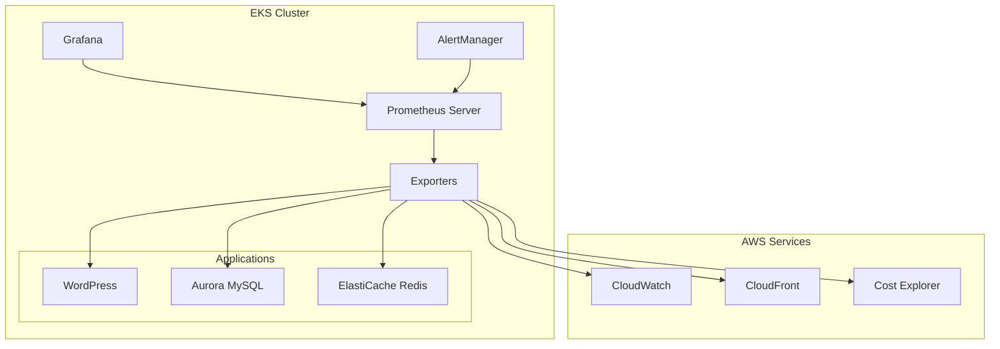

# Observability Module

## Overview

The observability module provides comprehensive monitoring capabilities for the WordPress EKS platform, supporting both AWS CloudWatch and Prometheus-based monitoring stacks. This module enables metrics collection, visualization, alerting, and operational insights across the entire platform.

## Purpose

- **Dual Stack Support**: CloudWatch (legacy) and Prometheus (modern) monitoring
- **Complete Observability**: Metrics, logs, and traces for all platform components
- **High Availability**: Multi-AZ deployment with automatic recovery
- **Network Resilience**: Continues collecting metrics during network partitions
- **Cost Tracking**: Monitor AWS costs and resource utilization
- **CDN Monitoring**: CloudFront cache performance and content delivery metrics

## Key Resources

- **Prometheus Server**: Time-series metrics database with persistent storage
- **Grafana**: Visualization and dashboards for metrics analysis
- **AlertManager**: Alert routing and notification management
- **Metrics Exporters**: WordPress, MySQL, Redis, CloudWatch, and cost monitoring
- **CloudWatch Agent**: Legacy CloudWatch metrics and logs collection
- **Fluent Bit**: Log aggregation and forwarding

## Architecture



## Module Structure

```
modules/observability/
├── main.tf                    # Main module composition
├── variables.tf               # Input variables
├── outputs.tf                 # Module outputs
├── versions.tf                # Provider requirements
├── ha-dr.tf                   # High availability and disaster recovery
├── network-resilience.tf      # Network partition tolerance
└── modules/
    ├── prometheus/            # Prometheus server deployment
    ├── grafana/              # Grafana dashboards and visualization
    ├── alertmanager/         # Alert routing and notifications
    ├── exporters/            # Metrics exporters (WordPress, MySQL, Redis, CloudWatch, Cost)
    ├── cloudwatch/           # Legacy CloudWatch integration
    └── security/             # Security and compliance features
```

## Configuration

### Minimal Setup

Enable basic Prometheus monitoring:

```hcl
module "observability" {
  source = "../../modules/observability"
  
  # Core configuration
  name                    = "my-cluster"
  region                  = "us-west-2"
  cluster_name            = "my-eks-cluster"
  cluster_oidc_issuer_url = data.aws_eks_cluster.cluster.identity[0].oidc[0].issuer
  oidc_provider_arn       = aws_iam_openid_connect_provider.eks.arn
  
  # Enable Prometheus
  enable_prometheus_stack = true
  prometheus_storage_size = "50Gi"
  prometheus_retention_days = 30
}
```

### Production Setup

Full monitoring stack with high availability:

```hcl
module "observability" {
  source = "../../modules/observability"
  
  # Core configuration
  name                    = "production-cluster"
  region                  = "us-west-2"
  cluster_name            = "prod-eks-cluster"
  cluster_oidc_issuer_url = data.aws_eks_cluster.cluster.identity[0].oidc[0].issuer
  oidc_provider_arn       = aws_iam_openid_connect_provider.eks.arn
  namespace               = "observability"
  kms_key_arn             = aws_kms_key.logs.arn
  
  # Prometheus stack
  enable_prometheus_stack = true
  prometheus_storage_size = "200Gi"
  prometheus_retention_days = 90
  prometheus_replica_count = 3
  prometheus_storage_class = "gp3"
  
  # Grafana
  enable_grafana = true
  grafana_storage_size = "20Gi"
  grafana_replica_count = 2
  enable_default_dashboards = true
  
  # AlertManager
  enable_alertmanager = true
  alertmanager_replica_count = 3
  
  # Exporters
  enable_wordpress_exporter = true
  enable_mysql_exporter = true
  enable_redis_exporter = true
  enable_cloudwatch_exporter = true
  enable_cost_monitoring = true
  
  # CloudFront monitoring
  enable_cloudfront_monitoring = true
  cloudfront_distribution_ids = ["E1234567890ABC"]
  
  # High availability
  enable_backup_policies = true
  backup_retention_days = 30
  enable_automatic_recovery = true
  enable_cloudwatch_fallback = true
  fallback_alert_email = "ops@example.com"
  
  # Network resilience
  enable_network_resilience = true
  network_partition_threshold = 3
  metrics_sync_interval = 15
  
  # Service discovery
  enable_service_discovery = true
  service_discovery_namespaces = ["default", "wordpress", "kube-system", "observability"]
  
  tags = {
    Environment = "production"
    ManagedBy   = "Terraform"
  }
}
```

## Key Variables

| Variable | Type | Default | Description |
|----------|------|---------|-------------|
| `enable_prometheus_stack` | bool | `false` | Enable Prometheus monitoring |
| `enable_grafana` | bool | `false` | Enable Grafana dashboards |
| `enable_alertmanager` | bool | `false` | Enable AlertManager |
| `prometheus_storage_size` | string | `"50Gi"` | Prometheus storage size |
| `prometheus_retention_days` | number | `30` | Metrics retention period |
| `prometheus_replica_count` | number | `2` | Prometheus replica count |
| `enable_cloudfront_monitoring` | bool | `false` | Enable CloudFront CDN monitoring |
| `enable_network_resilience` | bool | `false` | Enable network partition tolerance |
| `enable_backup_policies` | bool | `false` | Enable automated backups |

## Key Outputs

| Output | Description |
|--------|-------------|
| `prometheus_url` | Internal Prometheus server URL |
| `grafana_url` | Internal Grafana URL |
| `alertmanager_url` | Internal AlertManager URL |
| `prometheus_role_arn` | Prometheus IAM role ARN |
| `monitoring_stack_summary` | Configuration summary |

## Integration with App Stack

The observability module is integrated into `stacks/app/main.tf`:

```hcl
module "observability" {
  source = "../../modules/observability"
  
  # Core configuration from infra stack
  name                    = local.name
  region                  = var.region
  cluster_name            = local.cluster_name
  cluster_oidc_issuer_url = local.cluster_oidc_issuer_url
  oidc_provider_arn       = local.oidc_provider_arn
  kms_key_arn             = local.kms_logs_arn
  
  # Configuration from app stack variables
  enable_prometheus_stack = var.enable_prometheus_stack
  enable_grafana          = var.enable_grafana
  enable_alertmanager     = var.enable_alertmanager
  
  # WordPress integration
  wordpress_service_name = module.app_wordpress.service_name
  wordpress_namespace    = var.wp_namespace
  
  tags = local.tags
  
  depends_on = [module.edge_ingress]
}
```

### Required Inputs from Infrastructure Stack

The module requires these outputs from `stacks/infra`:

- `cluster_name`: EKS cluster name
- `cluster_oidc_issuer_url`: OIDC issuer URL for IRSA
- `oidc_provider_arn`: OIDC provider ARN for IAM roles
- `kms_logs_arn`: KMS key for encryption

These are consumed via `data.terraform_remote_state.infra` in the app stack.

## Deployment

### Step 1: Configure Variables

In your Terraform Cloud workspace or `.tfvars` file:

```hcl
# Enable Prometheus stack
enable_prometheus_stack = true
prometheus_storage_size = "100Gi"
prometheus_retention_days = 90

# Enable Grafana
enable_grafana = true
enable_default_dashboards = true

# Enable AlertManager
enable_alertmanager = true
```

### Step 2: Deploy Infrastructure

```bash
# Deploy infrastructure first
cd stacks/infra
make plan-infra
make apply-infra
```

### Step 3: Deploy Application Stack

```bash
# Deploy application stack with observability
cd stacks/app
make plan-app
make apply-app
```

### Step 4: Verify Deployment

```bash
# Update kubeconfig
make kubeconfig

# Check observability pods
kubectl get pods -n observability

# Check services
kubectl get svc -n observability
```

## Accessing Components

### Prometheus

```bash
# Port-forward to Prometheus
kubectl port-forward -n observability svc/prometheus-kube-prometheus-prometheus 9090:9090

# Access at http://localhost:9090
```

### Grafana

```bash
# Port-forward to Grafana
kubectl port-forward -n observability svc/grafana 3000:80

# Access at http://localhost:3000
# Default credentials: admin / <configured-password>
```

### AlertManager

```bash
# Port-forward to AlertManager
kubectl port-forward -n observability svc/alertmanager-operated 9093:9093

# Access at http://localhost:9093
```

## Features

### Service Discovery

Automatically discovers and scrapes metrics from:
- Kubernetes pods with Prometheus annotations
- Services in configured namespaces
- Node exporters on all cluster nodes
- Application-specific exporters

### Metrics Exporters

- **WordPress Exporter**: PHP-FPM metrics, request rates, cache hits, plugin execution times
- **MySQL Exporter**: Database connections, queries, replication lag, InnoDB metrics, performance schema
- **Redis Exporter**: Cache hit rates, memory usage, key statistics, connection counts, eviction rates (with TLS support)
- **CloudWatch Exporter**: AWS service metrics from ALB, RDS/Aurora, ElastiCache, and EFS with automatic service discovery
- **Cost Exporter**: AWS cost tracking via Cost Explorer API, daily/monthly costs, forecasting, underutilized resource detection, spot instance savings

All exporters use IRSA for secure AWS API access and expose metrics on standard `/metrics` endpoints. Prometheus automatically discovers and scrapes these endpoints via ServiceMonitor CRDs.

### CloudFront CDN Monitoring

When enabled, monitors:
- Cache hit rates and performance
- Request rates and patterns
- Error rates (4xx, 5xx)
- Origin latency
- Data transfer volumes

### Grafana Dashboards

Pre-configured dashboards for:
- **WordPress Overview**: Application metrics including request rates, response times, active users, cache hit rates, database query performance, and plugin execution times
- **Kubernetes Cluster**: Infrastructure metrics including node CPU/memory usage, pod counts, disk and network I/O, and cluster capacity
- **AWS Services**: AWS service metrics including RDS Aurora, ElastiCache Redis, ALB, and EFS monitoring
- **Cost Tracking**: Daily and projected monthly costs, cost breakdown by service, spot vs on-demand comparison, and optimization recommendations

Dashboards support:
- Persistent storage with version control (20 versions retained)
- UI editing with changes persisted across pod restarts
- Auto-reload from ConfigMaps every 30 seconds
- Organized into logical folders for easy navigation

See [Dashboard Reference](../reference/dashboards.md) for detailed dashboard documentation.

### High Availability

- Multi-AZ pod distribution with topology spread constraints
- Pod disruption budgets for minimum availability
- Automatic health checks and recovery
- Persistent storage with KMS encryption
- AWS Backup integration for disaster recovery

### AlertManager

Provides high-availability alert routing and notification management:

- **Multiple Notification Channels**: Email (SMTP), AWS SNS, Slack webhooks, PagerDuty integration
- **Intelligent Routing**: Routes alerts based on severity and component labels
- **Alert Grouping**: Prevents alert storms through grouping and deduplication (10s group wait, 1h repeat interval)
- **Inhibition Rules**: Suppresses lower-severity alerts when critical alerts are firing
- **High Availability**: Multi-replica deployment with pod anti-affinity and gossip protocol for deduplication
- **Persistent Storage**: EBS-backed storage with KMS encryption for alert state
- **IRSA Integration**: Secure AWS SNS publishing via IAM Roles for Service Accounts

Alert routing configuration:
- **Critical alerts**: Sent to all channels (email, Slack, PagerDuty, SNS)
- **Warning alerts**: Sent to email and Slack warning channels
- **Component-specific routing**: WordPress, database, and infrastructure alerts routed to appropriate teams

See [Alert Rules Reference](../reference/alert-rules.md) for comprehensive alert definitions.

### Network Resilience

- Local metrics collection during network partitions
- Eventual consistency for metrics synchronization
- Intelligent retry logic with exponential backoff
- Automatic partition detection and recovery
- Configurable queue capacity and sync intervals

## Storage Considerations

### Prometheus Storage

- Default: 50Gi with 30-day retention
- Production: 100-200Gi with 90-day retention
- Storage class: gp3 (recommended)
- Growth rate: ~1GB per day per 1000 metric series

### Grafana Storage

- Default: 10Gi for dashboards and configuration
- Stores dashboard definitions and user preferences
- Backed up via AWS Backup policies

### AlertManager Storage

- Default: 10Gi for alert state
- Stores alert history and silences
- Minimal growth over time

## Security

### IAM Roles (IRSA)

Each component has dedicated IAM roles:
- **Prometheus**: CloudWatch read, Cost Explorer read, EC2 describe
- **Grafana**: CloudWatch read for data sources
- **AlertManager**: SNS publish for notifications
- **Exporters**: Service-specific read permissions

### Encryption

- At rest: KMS encryption for all persistent volumes
- In transit: TLS for all component communications
- Secrets: Stored in AWS Secrets Manager

### RBAC

- Monitoring viewer role: Read-only access
- Monitoring admin role: Full access
- Service accounts with minimal permissions

## Monitoring the Monitoring Stack

### Self-Monitoring

The stack monitors itself:
- Prometheus scrapes its own metrics
- Grafana self-monitoring dashboard
- AlertManager delivery tracking

### CloudWatch Fallback

When enabled, provides backup alerting:
- Critical alerts sent to CloudWatch
- SNS notifications for stack failures
- Ensures alerting during outages

## Troubleshooting

### Pods Not Starting

```bash
# Check pod status
kubectl get pods -n observability

# View pod events
kubectl describe pod -n observability <pod-name>

# Check logs
kubectl logs -n observability <pod-name>
```

### No Metrics Appearing

```bash
# Check Prometheus targets
kubectl port-forward -n observability svc/prometheus-kube-prometheus-prometheus 9090:9090
# Visit http://localhost:9090/targets

# Check service discovery
kubectl get servicemonitor -n observability
kubectl get podmonitor -n observability
```

### Storage Issues

```bash
# Check PVC status
kubectl get pvc -n observability

# Check storage capacity
kubectl exec -n observability <prometheus-pod> -- df -h /prometheus
```

### Network Partition Issues

```bash
# Check partition detector
kubectl logs -n observability -l app=network-partition-detector

# Check metrics sync status
kubectl get cronjobs -n observability
kubectl logs -n observability -l app=metrics-sync
```

## Cost Optimization

### Storage Costs

- Use gp3 instead of io1/io2 for general workloads
- Adjust retention period based on requirements
- Enable backup policies only for production

### Replica Costs

- Development: 1 replica per component
- Staging: 2 replicas per component
- Production: 3 replicas for critical components

### Exporter Costs

- Enable only required exporters
- CloudWatch exporter incurs API call costs
- Cost monitoring has minimal overhead

## Documentation

For detailed information, see:

- **Getting Started**: [Getting Started Guide](../getting-started.md)
- **Architecture**: [Architecture Overview](../architecture.md)
- **Monitoring Features**: [Monitoring Documentation](../features/monitoring/)
- **Operations**: [Operations Guides](../operations/)
- **Reference**: [Reference Documentation](../reference/)

## Support

For issues or questions:
1. Check troubleshooting section above
2. Review operational documentation
3. Check Kubernetes events and logs
4. Contact platform team
